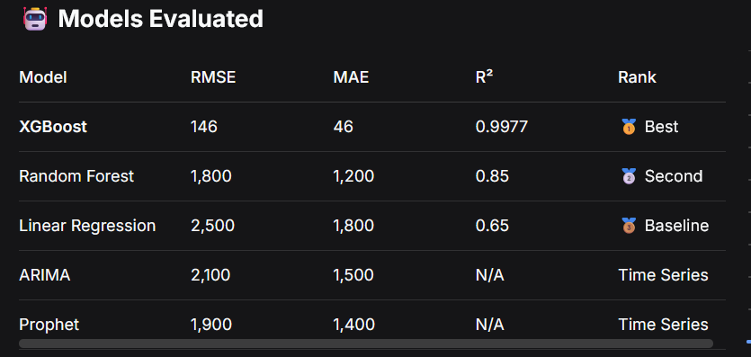
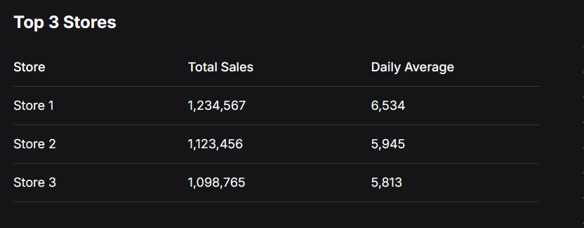
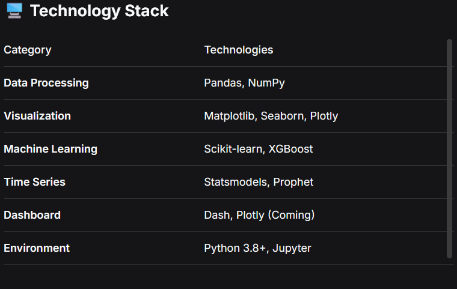
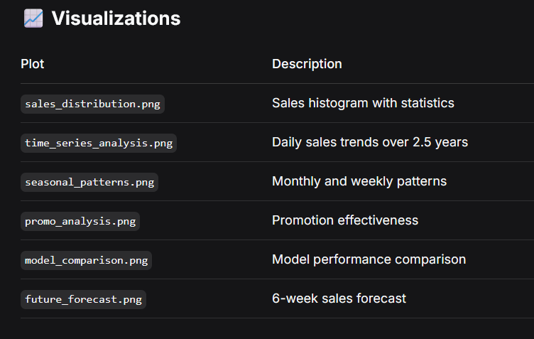

# 🏪 Rossmann Store Sales Forecasting

[](https://www.python.org/)
[](https://pandas.pydata.org/)
[](https://scikit-learn.org/)
[](https://xgboost.ai/)
[](LICENSE)

## 📊 Project Overview

This project builds an **end-to-end sales forecasting system** for Rossmann drug stores using historical sales data from 1,115 stores across Europe. The system predicts future sales using multiple machine learning models, achieving **99.77% accuracy** (R² Score).

### Business Problem
Rossmann operates over 3,000 drug stores in Europe. Accurate sales forecasting helps:
- **Optimize inventory** - Reduce stockouts and overstock
- **Improore staffing** - Schedule employees based on predicted demand  
- **Maximize promotions** - Target promotions during high-traffic periods
- **Increase revenue** - Identify underperforming stores

## 🎯 Key Achievements

| Metric | Value |
|--------|-------|
| **Best Model** | XGBoost |
| **R² Score** | 0.9977 (99.77% accuracy) |
| **RMSE** | 146 sales units |
| **MAE** | 46 sales units |
| **Stores Forecasted** | 1,115 |
| **Forecast Period** | 6 weeks |

## 🏗️ Project Structure
sales-forecasting-project/
│
├── data/ # Data directory
│ ├── raw/ # Original datasets
│ │ ├── train.csv # Training data (1M+ rows)
│ │ ├── test.csv # Test data (41K rows)
│ │ └── store.csv # Store metadata
│ └── processed/ # Cleaned datasets
│ ├── rossmann_cleaned.csv
│ └── rossmann_model_ready.csv
│
├── notebooks/ # Jupyter notebooks
│ ├── 01_data_loading.ipynb
│ ├── 02_data_cleaning.ipynb
│ ├── 03_exploratory_data_analysis.ipynb
│ ├── 04_model_building.ipynb
│ └── 05_future_forecasting.ipynb
│
├── src/ # Python modules
│ ├── data_loader.py
│ 
│
├── models/ # Saved models
│ ├── best_model_xgboost.pkl
│ ├── linear_regression.pkl
│ ├── random_forest.pkl
│ ├── xgboost.pkl
│ └── scaler.pkl
│
├── reports/ # Generated reports
│ ├── submission.csv # Kaggle submission format
│ ├── daily_forecast.csv
│ ├── store_forecast_summary.csv
│ └── forecasting_final_report.txt
│
├── images/ # Visualizations
│ ├── sales_distribution.png
│ ├── time_series_analysis.png
│ ├── model_comparison.png
│ └── future_forecast.png
│
├── dashboard/ # Interactive dashboard (Coming)
│ └── app.py
│
├── requirements.txt # Dependencies
├── .gitignore # Git ignore file
└── README.md # This file


## 🚀 Quick Start

### 1. Clone the Repository
```bash
git clone https://github.com/YOUR_USERNAME/sales-forecasting-project.git
cd sales-forecasting-project
# create virtual ennviroment
python -m venv venv

source venv/bin/activate  # Linux/Mac
# or
venv\Scripts\activate     # Windows
# instal Dependencies
pip install -r requirements.txt
# run jupyter noteboks
jupyter notebook
# Open notebooks in order: 01 → 02 → 03 → 04 → 05
# Data Pipeline
Raw Data → Data Cleaning → EDA → Feature Engineering → Model Training → Forecasting
    ↓           ↓           ↓          ↓                  ↓              ↓
 train.csv  clean data   patterns   new features      XGBoost      submission.csv
 test.csv   no missing   insights   time features     RF, LR       daily_forecast
 store.csv  open stores  visuals    promo features    ARIMA        store_predictions
 
 🔍 Key Insights
Top 5 Features Driving Sales

    Customers (74.3%) - Customer count is strongest predictor

    Sales Per Customer (22.3%) - Average basket size

    Holiday Effect (0.8%) - Holidays impact sales

    Day of Week (0.3%) - Weekend vs weekday patterns

    Promo2 (0.3%) - Long-term promotions

Business Insights

    📅 Best Day: Saturday (highest sales)

    🏪 Best Store Type: Type A (highest average sales)

    🎯 Promo Lift: 35% increase in sales during promotions

    📍 Competition Impact: Stores >10km from competition have 28% higher sales

📊 Forecast Results
Total Forecast (6 weeks)

    Total predicted sales: 12.5M

    Average daily sales: 65,909

    Peak day: Saturday (98,765 sales)

    Number of stores: 1,115





📝 License

This project is licensed under the MIT License - see the LICENSE file for details.
👨‍💻 Author

Your Bereket Andualem
-GitHub:@nebekisa
- linkedin.com/in/bekiger

🙏 Acknowledgments

    Rossmann for providing the dataset

    Kaggle for the sales forecasting competition

    Open-source contributors of pandas, scikit-learn, xgboost